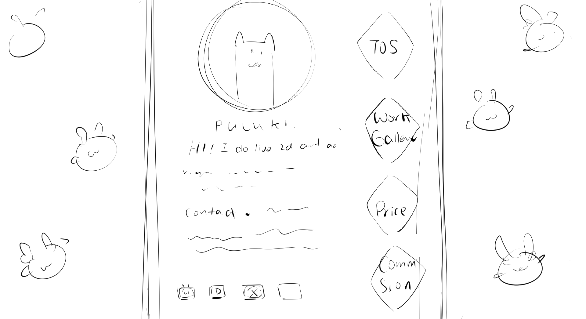
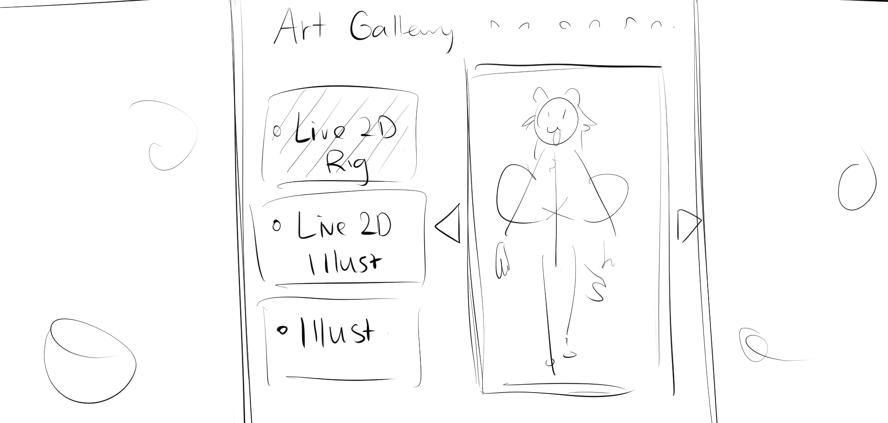
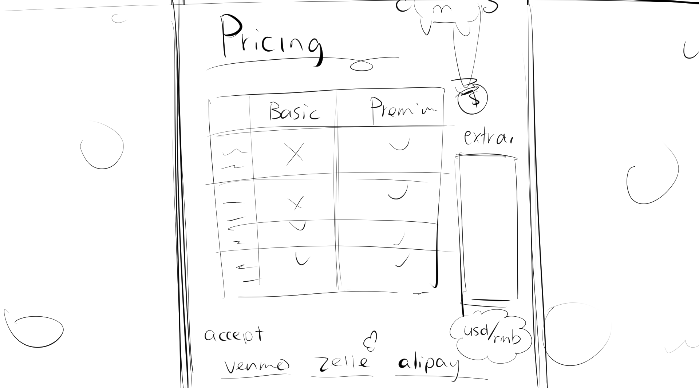
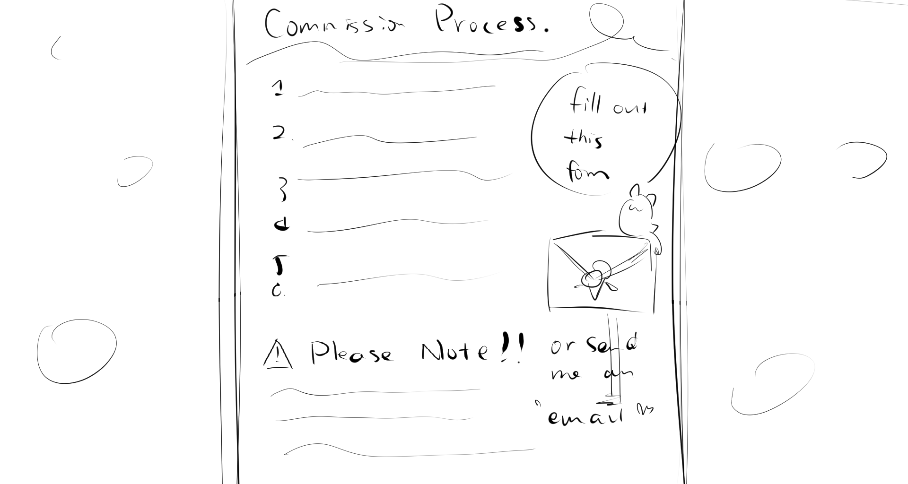
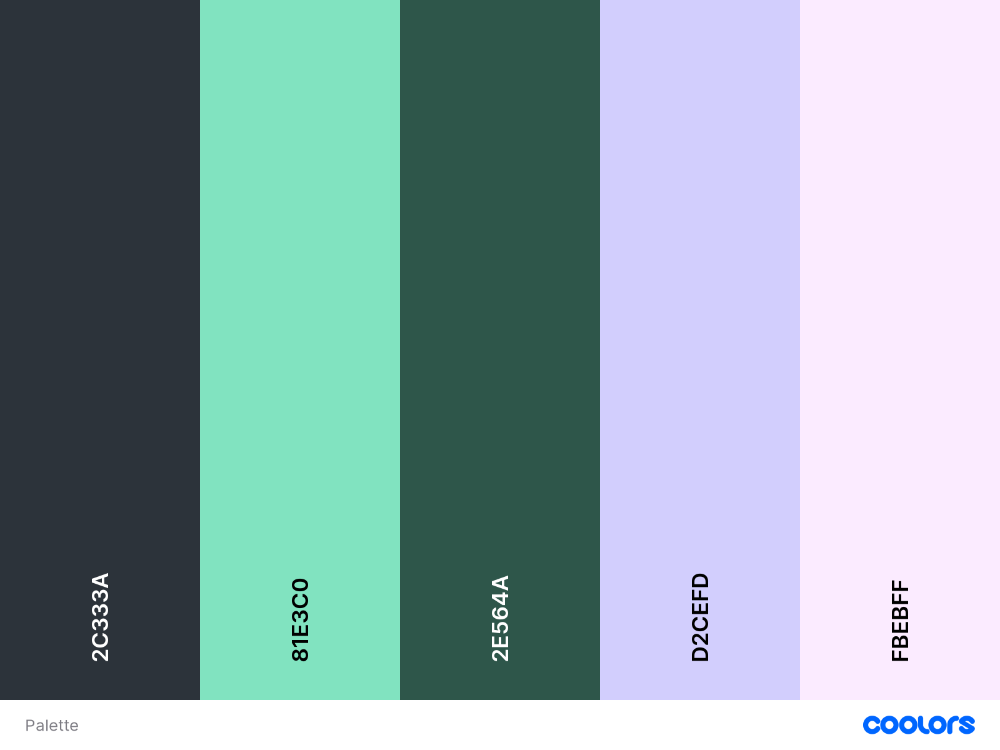

**Idea: Create a website for work showcase and commission submission**

* Live2D: A software that allows 2D models to be animated in real-time. Its core is the combination of a proprietary file and a JSON file that defines animations.
* Hence the website will have less work but hopefully interactive 
* The goal is to create a website that displays work in a straightforward manner, and allows users to submit commission requests.

----------------

**Site Architecture**
* Personal Bio & Contact Information (On the front page)
* Terms of Service
* Work Gallery
  * Live2D Modeling
  * Live2D Illustration
  * Regular Illustration
* Commission Price List
* Commission Submission Form

----------------
Per-Page Breakdown
**Personal Bio & Contact Information**
* Avatar with frame
* Name
* Brief Introduction
* Contact Information
* Links to socials

**Terms of Service**  

**Work Gallery**

* Will use Heroku to embed models / (or gif, depending on availability) onto the website
* I wonder if there is a way to do something like shown on the wireframe (toggling showcase slideshow) without Javascript? 

**Commission Price List**

* A table showing the details of each part of commission
* Extra items/premiums
* Acceptable payment methods

**Commission Submission Form**

* A basic form to start the commission process.
* Extra notes complementing the form

----------------
**References**
https://mochipupu.carrd.co
https://2wintails-comms.carrd.co/

